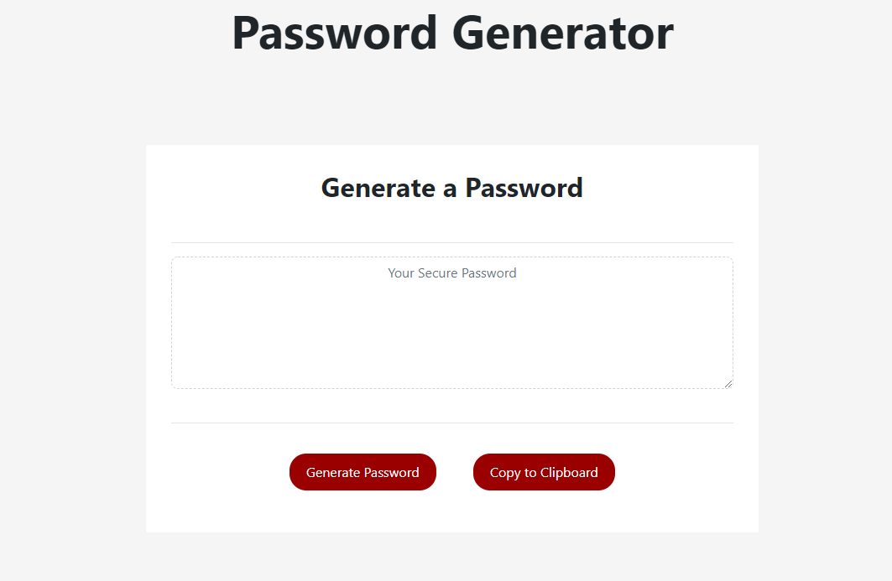

# My Portfolio

## Table of contents
* [General info](#general-info)
* [Technologies](#technologies)
* [Screenshot](#screenshot)
* [Credits](#credits)
* [License](#license)

## General info
This project is a random password generator. It allows the user to create a secure password between 8 and 128 characters in length and allows them to use at least one of four different character types which include: special characters, number characters, lowercase characters and uppercase characters. The user is also able to copy the password to their clipboard after it is generated. 
	
## Technologies
This project is created with:
* HTML:5
* Bootstrap 4
* CSS
* JavaScript

## Screenshot

# Credits
I consulted W3Schools (https://www.w3schools.com/js/default.asp), MDN Web Docs (https://developer.mozilla.org/en-US/docs/Web/JavaScript) and Bootstrap 4 (https://getbootstrap.com/) extensively in creating my project. Some other resources that I used include: Stack Overflow (#https://stackoverflow.com/) and the GitLab repository for my course, specifically referencing the in-class activities. 

## License
MIT License

Copyright (c) [2019] [Rachel Rohrbach]

Permission is hereby granted, free of charge, to any person obtaining a copy
of this software and associated documentation files (the "Software"), to deal
in the Software without restriction, including without limitation the rights
to use, copy, modify, merge, publish, distribute, sublicense, and/or sell
copies of the Software, and to permit persons to whom the Software is
furnished to do so, subject to the following conditions:

The above copyright notice and this permission notice shall be included in all
copies or substantial portions of the Software.

THE SOFTWARE IS PROVIDED "AS IS", WITHOUT WARRANTY OF ANY KIND, EXPRESS OR
IMPLIED, INCLUDING BUT NOT LIMITED TO THE WARRANTIES OF MERCHANTABILITY,
FITNESS FOR A PARTICULAR PURPOSE AND NONINFRINGEMENT. IN NO EVENT SHALL THE
AUTHORS OR COPYRIGHT HOLDERS BE LIABLE FOR ANY CLAIM, DAMAGES OR OTHER
LIABILITY, WHETHER IN AN ACTION OF CONTRACT, TORT OR OTHERWISE, ARISING FROM,
OUT OF OR IN CONNECTION WITH THE SOFTWARE OR THE USE OR OTHER DEALINGS IN THE
SOFTWARE.